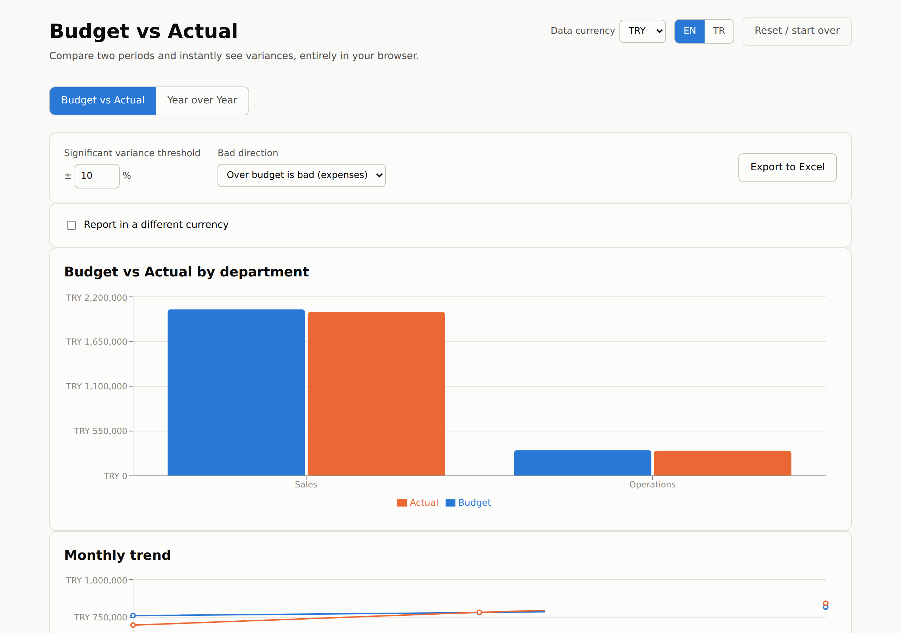

# Budget vs Actual

A small, client-side web app for comparing two periods of financial data and instantly seeing variances — built for accounting and FP&A teams who currently do this comparison by hand in Excel every month.

Upload your data, map your columns, and the tool matches rows by account code, month, and department, calculates the variance in amount and percent, flags anything that crosses a threshold you control, and lets you export the result back to Excel — all in your browser. Nothing is uploaded to a server, which makes it safe to use with real financial data.



<sub>Column mapping step, with auto-suggested field guesses: see [docs/screenshots/column-mapping.png](docs/screenshots/column-mapping.png).</sub>

## Two analysis modes, one underlying model

Under the hood, every comparison this tool does is the same shape: a **base period** vs a **comparison period**. The mode switch at the top of the app picks what those two sides mean:

- **Budget vs Actual** — base = your budget, comparison = your actual. Rows are matched by account code + month (+ department).
- **Year over Year** — base = one calendar year's actuals, comparison of another year's actuals. Rows are matched by account code + *month-of-year* (+ department), so January lines up with January regardless of year. Useful when there's no budget to compare against at all, which is common for some periods/entities.

Because both modes share the same matching, variance math, threshold flagging, bad-direction toggle, charts, unmatched-row handling, currency-reporting, and Excel export, switching modes doesn't change how any of that behaves — only what the two sides are called and how they're uploaded.

Switching modes clears the current upload and results (with a confirmation if you're mid-flow), since the two modes need differently-shaped input.

## How it works

1. **Pick a mode** — Budget vs Actual or Year over Year, from the switch at the top.
2. **Upload**
   - *Budget vs Actual*: two files (Budget + Actual) by default, or toggle to one combined file that already has both amount columns.
   - *Year over Year*: one actuals file that spans multiple years — you don't need to split it into separate files per year.
3. **Map columns** — the app guesses which of your uploaded columns map to each expected field (account code, account name, department, month, amount) and lets you correct any guess. Your original headers don't need to match ours. In Year over Year mode, you also pick which two years to compare from the years detected in your file.
4. **Review** — a bar chart of base vs comparison by department (or account, if departments aren't present), a monthly trend line (once more than one month is present), a sortable variance table (biggest variances first), a **Total by account** roll-up across all uploaded months (handy for year-over-year, which is usually read cumulatively), and a separate section listing any rows that only appear on one side — including accounts that only exist in one year (new or discontinued lines), which are never silently dropped.
5. **Adjust** — change the significance threshold (default ±10%) and flip which direction counts as "bad" — the table and charts update immediately.
6. **Export** — download an `.xlsx` with the original data plus calculated variance columns, a YTD-totals sheet, and a summary sheet by department.

Use **Reset / start over** on the results screen to clear everything and upload new data.

## Locale vs. currency

The **EN / TR toggle** in the header controls *only* number and date formatting conventions — `1,234.56` (EN) vs `1.234,56` (TR). It never changes what currency your amounts are in.

The currency itself is set separately with the **Data currency** selector (TRY, USD, EUR, GBP) — you're telling the app what currency the numbers in your file already represent. This is a label/symbol choice only; the app does not fetch or apply any exchange rate for it. If you need to see the numbers converted into another currency, see the next section.

## Reporting in a different currency (FX variance decomposition)

Sometimes the base and comparison periods were valued at different FX rates, and you want to know how much of the total variance is genuinely operational (you spent/earned more or less) versus just currency movement. This works the same way in both analysis modes — in Budget vs Actual the two rates per month are the budget (plan) rate and the actual (realized) rate; in Year over Year they're each year's own rate. Enable **"Report in a different currency"** on the results screen to see the split.

**Everything switches to the target currency at once.** Once enabled, the department bar chart, the monthly trend line, the variance table, the Total-by-account roll-up, and the Excel export all show figures in the target currency — axis labels, tooltips, columns, and totals alike. The data currency is never shown alongside it; there is only ever one currency on screen at a time.

**Rates are entered per calendar month, not once for the whole analysis**, since a realized rate genuinely moves month to month:

- A **rate table** appears with one row per month actually present in your data, grouped by year. Budget-vs-actual months get both a base-rate and a comparison-rate column (since a budget line and its actual line share the same calendar month); Year-over-year months get whichever single column applies to that year.
- For the base-rate column specifically (the "plan" side), each year group has an **"Apply one rate to all months"** shortcut, since a budget or reference rate is often a single figure set once for the year. The comparison-rate column (realized rates) has no such shortcut — those are expected to vary and are entered per month.
- You can **paste a column of rates copied from Excel** directly into the first cell of a column; it fills downward through the remaining months.
- **A month with no rate is flagged, never assumed to be 1.0.** Its cells show "No rate" instead of a number, and it's excluded from converted totals (rather than silently guessing) — check the rate table if a total looks lower than expected.

### Rate quote convention (which way does the number go?)

Every rate field is labeled with the exact quote it expects, generated from your two currencies, e.g. **"1 USD = ? TRY"**. Type the number exactly as you'd see it quoted in the market — you never need to work out which way to divide.

The label always anchors on whichever of the two currencies is conventionally quoted as "1 unit" against the other (`EUR` > `GBP` > `USD` > `TRY`, matching how these pairs actually trade — nobody quotes "1 TRY = 0.024 USD"). Critically, **the label for a given currency *pair* is the same no matter which one is your data currency and which is the target** — only the arithmetic direction the app applies internally changes:

- Data currency **TRY**, target **USD**, rate entered as `42` (i.e. "1 USD = 42 TRY"): the app **divides** — ₺2,095,000 becomes $2,095,000 ÷ 42 ≈ $49,881.
- Data currency **USD**, target **TRY**, the *same* rate `42`: the app **multiplies** — $100 becomes $100 × 42 = ₺4,200.

Both directions use the identical number you'd read off a rate sheet; converting one way and back with the same rate returns you to the original amount. This is covered by automated tests (`src/lib/fxQuote.test.ts`, `src/lib/calculateFxVariance.test.ts` — run with `npm test`) that check both directions are exact reciprocals of each other, using the TRY/USD scenario above among others.

For each row with both rates present, the total variance in the target currency is split into:

```
Total variance       = comparison_local × r_comparison − base_local × r_base
Operational variance = (comparison_local − base_local) × r_base
FX variance          = comparison_local × (r_comparison − r_base)
```

Here `r_base` and `r_comparison` are the *effective* target-per-1-data-unit multipliers — i.e. the number you typed if your data currency is the quote's anchor, or its reciprocal if the target currency is the anchor. You never compute this yourself; the app derives it from what you entered and the quote label it showed you.

`Operational variance + FX variance` always equals `Total variance` exactly for every convertible row — the app runs a reconciliation check on every row and throws if it doesn't add up, so this isn't just a documentation promise.

**Convention:** the FX effect is measured **on comparison-side volume** — it's "what would the rate movement alone be worth if the comparison amount had been converted at the base rate instead?" This means the operational variance is valued at the *base* rate and the residual (the FX variance) absorbs the rest.

If you pick a target currency that's the same as your data currency, there's nothing to convert, so the split is hidden entirely.

The variance table (and the Total-by-account roll-up) gain **Operational Variance** and **FX Variance** columns in the target currency, and a small summary above the table shows the totals for all three figures. The Excel export mirrors this: the detail and YTD-totals sheets show converted amounts and the same two extra columns, the Summary sheet's department totals are in the target currency, and the Notes sheet lists the full rate table grouped by year (including which months, if any, were left unconverted).

Try it with the bundled USD sample data ([`sample-data/budget-usd.csv`](sample-data/budget-usd.csv) / [`sample-data/actual-usd.csv`](sample-data/actual-usd.csv)): set **Data currency** to USD, upload those two files, then enable currency reporting with target **TRY**. The rate table will label its columns "1 USD = ? TRY" — use "Apply one rate to all months" to set the budget rate to **32** for the year, then enter monthly actual rates (e.g. **33, 34, 35** for Jan/Feb/Mar) — the `6000` account in January has identical amounts on both sides in USD, so its entire variance in TRY is pure FX, making the split easy to sanity-check. Leave one month's actual rate blank to see how a missing rate is flagged and excluded rather than assumed. Then try it the other way: switch **Data currency** to TRY and target to USD instead — the label stays "1 USD = ? TRY", but typing the same `32` now correctly divides instead of multiplies.

## Expected input format

Real budget files are messy, so the tool is built to open them as they come out of your accounting system rather than demanding a cleaned-up sheet.

**What it handles automatically:**

- **Months across the top or down a column.** Most company budgets put one column per month (`Jan-26`, `Feb-26`, …). The tool detects that layout, asks you to confirm which columns are periods, and reshapes it internally. A file with a single `Period` column works too — pick whichever matches your file.
- **Title and preamble rows.** Exports usually start with the company name, a report title and a blank row before the real header. The header row is detected automatically, and you can correct it from a dropdown that previews each row.
- **Multiple worksheets.** The sheet that most looks like data is selected by default (so a cover sheet doesn't win), and you can switch to any other sheet.
- **Subtotal and section rows.** `TOTAL REVENUE`, `ARA TOPLAM`, `GENEL TOPLAM` and unlabelled section headings are separated out so they cannot double-count — on the bundled sample, including them would exactly double every figure. An account legitimately named `Total Rewards Program` is *not* removed.
- **Hierarchical charts of accounts.** Ledger exports usually print the parent account above its sub-accounts:

  | | | |
  |---|---|---|
  | `770` | Genel Yönetim Giderleri | 100,000 |
  | `770.01` | Personel Giderleri | 70,000 |
  | `770.02` | Kira Giderleri | 20,000 |
  | `770.03` | Kırtasiye Giderleri | 10,000 |

  Adding those four rows counts the money twice. The parent carries a real account code and an ordinary name, so no naming rule can catch it — the tool checks the arithmetic instead: within the same department and month, a line whose every amount equals the sum of the lines directly beneath it is a roll-up, and is set aside. Because the numbers decide, a parent that carries postings of its *own* on top of its children (so the figures don't tie) is correctly left alone, and so is a flat chart of accounts. Codes separated by `.`, `-`, `/`, `_` and plain numeric extensions (`770` → `77001`) are all recognised.

  Nothing is ever removed quietly. Every line set aside — subtotal, section heading or parent roll-up — is listed in its own panel with the reason, and one switch puts them all back if the detection got your file wrong.
- **Your column names.** `GL Code`, `Hesap Kodu`, `Account #` — headers are auto-matched to the fields the tool needs and every guess is editable.
- **Number formats.** `1,234.56`, `1.234,56`, `(1.234)` and currency symbols all parse.

**What it still needs from you:** each line must have a period it belongs to and an amount. Rows with no recognisable period are skipped.

The minimum shape, once mapped:

| Field | Required | Example |
|---|---|---|
| `account_code` | Yes* | `5000` |
| `account_name` | No | `Marketing Expenses` |
| `department` | No | `Sales` |
| period | Yes | `2026-01`, `Jan-26`, or a column per month |
| amount | Yes | `40000` |

\* Rows without an account code are treated as subtotals/headings and reported separately rather than dropped.

**Year over Year** needs the same fields, with rows spanning at least two calendar years so there is something to compare.

### Sample files

- [`sample-data/company-budget-pack.xlsx`](sample-data/company-budget-pack.xlsx) — **the realistic one.** A three-sheet management pack with a cover sheet, title rows, months across the top, section headings and subtotals in English and Turkish, and a hierarchical `770` block with its sub-accounts. Use `Budget 2026` as the budget and `Actuals 2026` as the actual.
- [`sample-data/budget.csv`](sample-data/budget.csv) / [`sample-data/actual.csv`](sample-data/actual.csv) — tidy long-format pair, also loaded by the **Try it with sample data** button.
- [`sample-data/budget-usd.csv`](sample-data/budget-usd.csv) / [`sample-data/actual-usd.csv`](sample-data/actual-usd.csv) — USD-denominated, for the currency-reporting feature.
- [`sample-data/actuals-2yr.csv`](sample-data/actuals-2yr.csv) — two years of actuals for Year over Year, including a new and a discontinued account.

Rows are matched by `account_code` + period (+ `department`, when present). Anything present on only one side is surfaced in its own section, never silently dropped. A blank or zero base amount shows "N/A" for the percentage rather than erroring.

## Running locally

```bash
npm install
npm run dev
```

Then open the printed local URL in your browser.

To build for production:

```bash
npm run build
npm run preview
```

To run the unit tests (currency conversion and FX reconciliation logic):

```bash
npm test
```

## Deploying

This is a static site — any static host works. The simplest options:

- **Vercel**: import the repo, framework preset "Vite", no environment variables needed.
- **Netlify**: build command `npm run build`, publish directory `dist`.

Because everything runs client-side, there's no backend to configure and no data ever leaves the visitor's browser.

## Tech stack

- React + Vite + TypeScript
- [Recharts](https://recharts.org/) for the bar and trend charts
- [PapaParse](https://www.papaparse.com/) for CSV parsing
- [ExcelJS](https://github.com/exceljs/exceljs) for reading and writing `.xlsx` files (chosen over the `xlsx`/SheetJS package on npm, which has unpatched high-severity advisories)

## Roadmap / known limitations

- **v1 is client-side only** — there's no saved history. Re-uploading files starts a fresh comparison every time.
- The "bad direction" for significant-variance highlighting is a single global setting, not configurable per account or department yet.
- FX rates are entered manually, one per calendar month — there's no live exchange-rate lookup (by design, since the app makes no network calls with your data).
- All rows share a single data currency; multi-currency datasets (different rows already in different currencies) aren't supported in v1.
- Year over Year currently compares exactly two years at a time; multi-year trends (3+ years) aren't visualized yet.
- Column mappings aren't saved between sessions — you'll re-map if your file headers change.
- Number/date parsing handles common US, EU, and Turkish formatting conventions, but very unusual formats may need manual cleanup before upload.
- Possible v2: optional backend + auth so a small team can save uploads and compare month over month without re-uploading.
- Possible v2: department-level access control (a department only sees its own budget lines).

## License

MIT — see [LICENSE](LICENSE).
